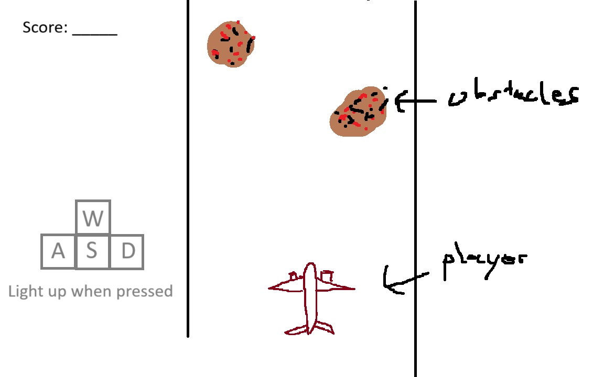

:warning: Everything between << >> needs to be replaced (remove << >> after replacing)

# << Project Title >>
## CS110 Final Project  << Semester, Year >>

## Team Members

Jake Edelstein

***

## Project Description

Mobile game-esque obstacle dodging game where the user controls a sprite and avoids falling obstacles. Points are gained from length of survival (maybe from coins or such as well)

***    

## GUI Design

### Initial Design

### Final Design

## Program Design

### Features

1. Start screen
2. Character select menu
3. Collision with obstacles
4. Point counter and timer
5. 

### Classes

- << You should have a list of each of your classes with a description >>

## ATP

| Step                 |Procedure             |Expected Results                   |
|----------------------|:--------------------:|----------------------------------:|
|  1                   | Run Counter Program  |GUI window appears with count = 0  |
|  2                   | click count button   | display changes to count = 1      |
etc...
 timer