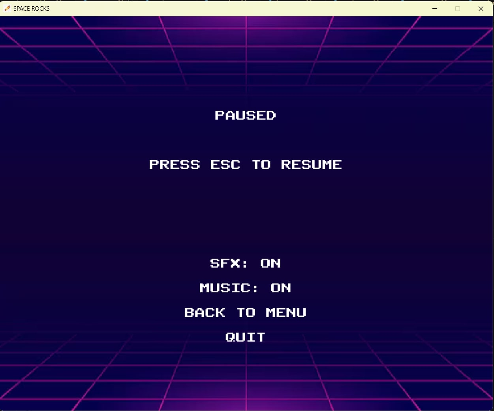

# Space Rock
## CS110 Final Project  << Fall, 2024 >>

## Team Members

Jake Edelstein

***

## Project Description

My project consists of a ship sprite which is controlled by the player, with the goal of avoiding the falling space rocks and make it out of their own personal 'meteor storm'. The player gains points by surviving, but the asteroids fall faster and more frequently as time progresses. The game ends when the player is hit.

***    

## GUI Design

### Initial Design

### Final Design

## Program Design

### Features

1. Start screen
2. Character select menu
3. Collision with obstacles
4. Point counter and timer
5. 

### Classes
    Ship
     - Creates a ship to be controlled by the player
     - Allows user to move up, down, left, right and diagonally.

 - Ship
     - Creates a ship to be controlled by the player
     - Allows user to move up, down, left, right and diagonally.
 
 - Asteroid
     - Creates asteroids which fall across the screen

## ATP

|Step |           Procedure                                |        Expected Results           |
|-----|:--------------------------------------------------:|----------------------------------:|
|  1  | Hit the play button.                               | window opens with count = 0       |
|  2  | Press the W or up arrow key.                       | display changes to count = 1      |
|  3  | Confirm that the ship moves upwards.               |                                   |
|  4  | Confirm that the ship stays within its boundaries. |                                   |
|  5  | Press the W and A keys at the same time.           |                                   |
|  6  | Confirm that the ship moves diagonally.            |                                   |
etc...
 timer